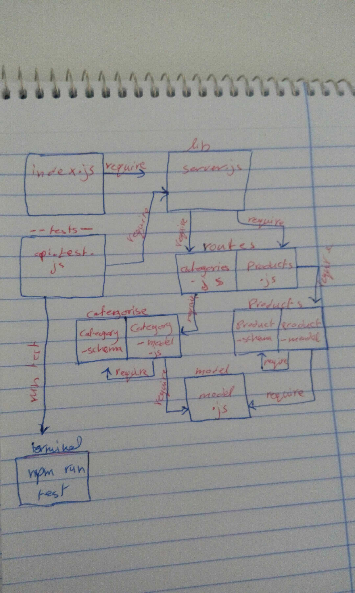

# LAB - Class 09

## API Server

### Author: Saja Swalgah

### Links and Resources

- [submission PR](https://github.com/Saja-401-advanced-javascript/class-09/pull/1)
- [ci/cd](https://github.com/Saja-401-advanced-javascript/class-09/runs/425071259?check_suite_focus=true)

### Setup

#### `.env` requirements (where applicable)

MONGODB_URI=mongodb://localhost:27017/simple-server
PORT=6000

#### How to initialize/run your application (where applicable)

-  `npm start`

#### Tests

- How do you run tests? npm run test

#### UML

